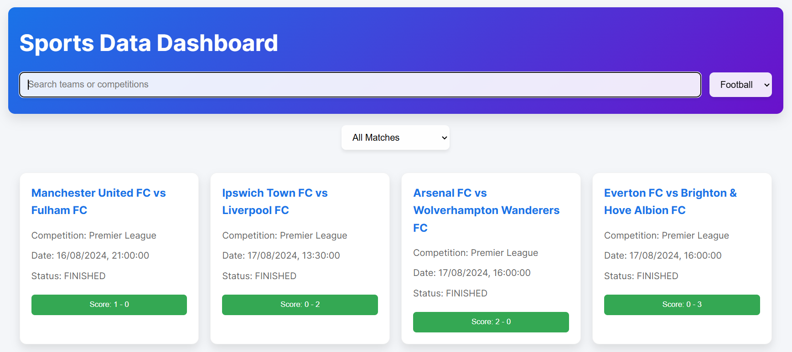
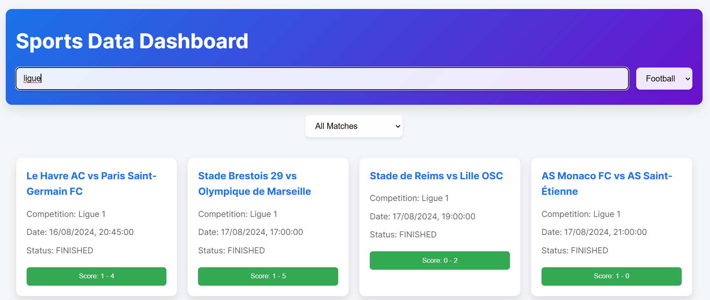

# Sports Data Dashboard ⚽

**Sports Data Dashboard** is a sleek, interactive web app that lets users explore live matches, team stats, and upcoming games for various football leagues. Built with JavaScript and Express, it fetches real-time data from an external football API and offers a responsive, user-friendly experience.

## Screenshots 📸

1. **Home Page**: 
 
2. **Search Results**: 


## Live Website 🌐  
[Explore the live app here](https://web-02.divinebirasa.tech/)

## Demo Video 🎥  
[Watch the demo video here](#)

## Features ✨

- **Comprehensive Search**: Search for teams or competitions across major football leagues.
- **Live Match Updates**: View live scores and match details in real time.
- **Filter Matches**: Sort by today's matches or upcoming fixtures.
- **Team Stats**: Access statistics for teams and players.
- **Authentication**: Simple login/register modal for user interaction.
- **Responsive Design**: Optimized for both desktop and mobile use.

## Technologies Used 🛠️

- **Frontend**: JavaScript, HTML, CSS
- **Backend**: Express.js
- **API Integration**: [Football-Data.org API]
- **Deployment**: Docker, Nginx, Node.js

## Docker Version 🏗️

1. **Build the Docker image**:  
   ```bash
   docker build -t sports-dashboard .
   ```

2. **Run the Docker container**:  
   ```bash
   docker run -d -p 8080:8080 sports-dashboard
   ```

3. **Access the app**:  
   Open [http://localhost:8080](http://localhost:8080) in your browser.

## Local Installation 🏗️

1. **Clone the repository**:  
   ```bash
   git clone https://github.com/your-username/sports-data-dashboard
   cd sports-data-dashboard
   ```

2. **Install dependencies**:  
   ```bash
   npm install
   ```

3. **Start the development server**:  
   ```bash
   npm start
   ```

4. **Open** [http://localhost:8080](http://localhost:8080) in your browser to explore the app.

## Acknowledgements 🙌

- **Football-Data.org API** for providing match and team data.
- **Express.js** for powering the backend.
- **Docker** and **Nginx** for deployment.
